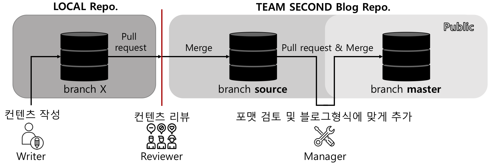

# TEAM SECOND Blog


## 블로그 운영 프로세스

---



### Three branches 

* **블로그** 저장소의 **마스터(master)** 브랜치:  팀세컨드 블로그의 마스터 브랜치. https://teamsecond.github.io/로 호스팅 되는 브랜치. 공개가능한 내용과 형태의 아티클만 Merge된다.
* **블로그** 저장소의 **소스(source)** 브랜치: 팀세컨드 블로그의 소스 브랜치. 마스터로 Merge되기 전에 raw한 블로그 글들이 리뷰를 거쳐서 Merge된다. 이후에 매니저의 검수를 거쳐서 마스터 브랜치로 Merge된다. 
* **로컬** 저장소의 **로컬** 브랜치: 글작성자가 임의로 수정해보고 테스트해볼 수 있는 작성자의 로컬저장소. 블로그 저장소를 fork하여 컨텐츠를 작성한 후, 완성될 경우 블로그의 소스브랜치로 Pull Request를 만들어 리뷰를 받는다.  

Local -> Source: 컨텐츠 자체 내용 리뷰후 Merge
Source -> Master: 리뷰된 컨텐츠를 블로그내에서의 포맷팅에 맞춰 Merge 혹은 기능/디자인 추가

### Actors

* 작성자 (Writer): 컨텐츠 제작자. 
* 리뷰어 (Reviewer): 컨텐츠자체의 내용 검수 및 피드백.
* 관리자 (Manager): 컨텐츠의 블로그내에서의 포맷 검수 및 추가. 혹은 기능 추가등 블로그의 전반적인 관리.

### 블로그 글 작성 및 리뷰 프로세스

1. 메인 저장소에서 소스 브랜치 fork 
2. Fork한 로컬 저장소에서 컨텐츠 작성
   1. _post에 markdown 글 작성
   2. 필요할 경우 카테고리 생성
3. 블로그 저장소의 소스브랜치에 Pull Request를 통해 리뷰 신청
   * **리뷰기간동안  fork한 저장소를 개인머신등을 통해 호스팅하여 리뷰어들이 볼 수 있도록 한다.**
4. 리뷰어들이 모두 리뷰를 마치면 소스 브랜치에 작성자가 Merge
5. 관리자는 Merge된 컨텐츠들을 블로그의 형식에 맞게 검수 및 정리하여 마스터 브랜치로 Pull Request&Merge하여 웹으로 공개한다.

## Fork한 블로그를 로컬머신에서 호스팅하는 방법

---

### Prerequisite

- Install ruby, gem, bundler
- Install Jekyll: https://jekyllrb.com/docs/installation/

### Hosting

```
bundle install
bundle exec jekyll serve --watch
// http://127.0.0.1:4000
```
